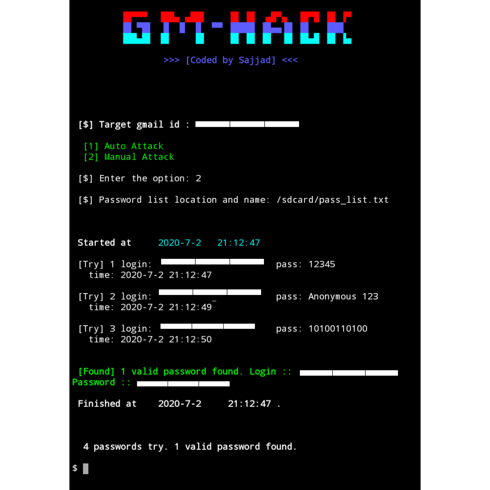

<h2 Align="center">Gm-Hack<h2/>


## About Gm-Hack:
Gm-Hack is a python based tool. It is a gmail brute force attack tool. Which use to crack gmail password and test the password strength of gmail account.

## Gm-Hack is available for:
- Termux

## Screenshot:


## Installation guide:
```
$apt-get update -y
```
```
$apt-get upgrade -y
```
```
$pkg install git -y
```
```
$pkg install python -y
```
```
$pkg install python3 -y
```
```
$git clone https://github.com/Background-Sajjad/Gm-Hack
```
```
$cd
```
```
$ls
```
```
$cd Gm-Hack
```
```
$python3 gm-hack.py
```

## My GitHub id link:
https://github.com/Background-Sajjad

## Warning:
**This tool is only for educational purposes. Don't use it any illegal. We are not responsible for damage or misuse by this tool.**


